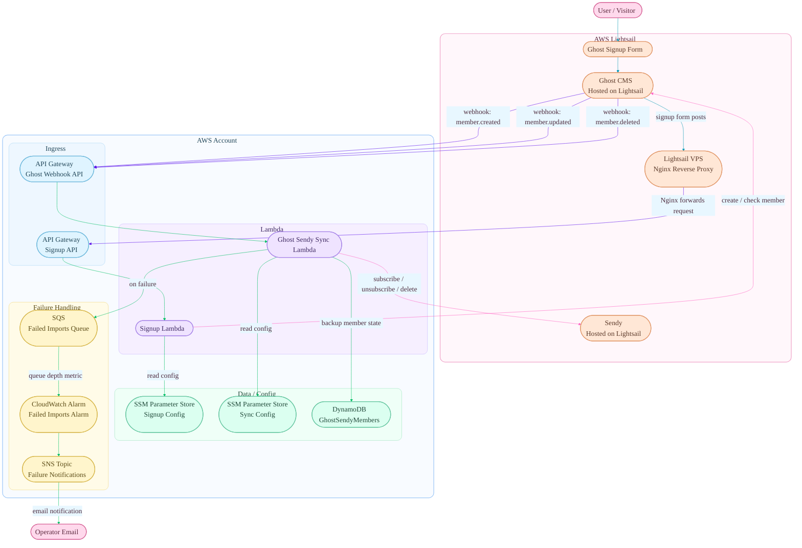

```mermaid
%%{init: {'theme': 'base', 'themeVariables': { 'fontSize': '22px', 'fontFamily': 'Trebuchet MS, Verdana, sans-serif', 'primaryColor': '#ffe7f3', 'primaryTextColor': '#4d2b3d', 'primaryBorderColor': '#e58ab3', 'lineColor': '#d88fb1', 'secondaryColor': '#e8f7ff', 'tertiaryColor': '#fff6d9', 'clusterBkg': '#fffafc', 'clusterBorder': '#f2a9c8'}}}%%
flowchart TB
    user(["User / Visitor"])

    subgraph lightsail["AWS Lightsail"]
        ghost(["Ghost CMS<br/>Hosted on Lightsail"])
        sendy(["Sendy<br/>Hosted on Lightsail"])
        vps(["Lightsail VPS<br/>Nginx Reverse Proxy"])
        form(["Ghost Signup Form"])
    end

    subgraph aws["AWS Account"]
        subgraph edge["Ingress"]
            signupApi(["API Gateway<br/>Signup API"])
            webhookApi(["API Gateway<br/>Ghost Webhook API"])
        end

        subgraph compute["Lambda"]
            signupLambda(["Signup Lambda"])
            syncLambda(["Ghost Sendy Sync Lambda"])
        end

        subgraph data["Data / Config"]
            signupParam(["SSM Parameter Store<br/>Signup Config"])
            syncParam(["SSM Parameter Store<br/>Sync Config"])
            memberTable(["DynamoDB<br/>GhostSendyMembers"])
        end

        subgraph failure["Failure Handling"]
            failedQueue(["SQS<br/>Failed Imports Queue"])
            alarm(["CloudWatch Alarm<br/>Failed Imports Alarm"])
            topic(["SNS Topic<br/>Failure Notifications"])
        end
    end

    ops(["Operator Email"])

    user --> form
    form --> ghost

    ghost -->|"signup form posts"| vps
    vps -->|"Nginx forwards request"| signupApi
    signupApi --> signupLambda
    signupLambda -->|"read config"| signupParam
    signupLambda -->|"create / check member"| ghost

    ghost -->|"webhook: member.created"| webhookApi
    ghost -->|"webhook: member.updated"| webhookApi
    ghost -->|"webhook: member.deleted"| webhookApi

    webhookApi --> syncLambda
    syncLambda -->|"read config"| syncParam
    syncLambda -->|"subscribe / unsubscribe / delete"| sendy
    syncLambda -->|"backup member state"| memberTable
    syncLambda -->|"on failure"| failedQueue
    failedQueue -->|"queue depth metric"| alarm
    alarm --> topic
    topic -->|"email notification"| ops

    classDef pink fill:#ffd9ec,stroke:#d96c9d,color:#5c2a3f,stroke-width:2px,font-size:22px;
    classDef peach fill:#ffe7d6,stroke:#e29a6d,color:#5c3a2a,stroke-width:2px,font-size:22px;
    classDef mint fill:#dbfff0,stroke:#69c7a2,color:#21493a,stroke-width:2px,font-size:22px;
    classDef lavender fill:#efe3ff,stroke:#a987e8,color:#3f2a63,stroke-width:2px,font-size:22px;
    classDef sky fill:#dff4ff,stroke:#6fb9dc,color:#23485a,stroke-width:2px,font-size:22px;
    classDef sunshine fill:#fff5cc,stroke:#d8b84f,color:#5b4b16,stroke-width:2px,font-size:22px;

    class user,ops pink;
    class ghost,sendy,form,vps peach;
    class signupApi,webhookApi sky;
    class signupLambda,syncLambda lavender;
    class signupParam,syncParam,memberTable mint;
    class failedQueue,alarm,topic sunshine;

    style lightsail fill:#fff7fb,stroke:#f0a6ca,stroke-width:2px,rx:16,ry:16,color:#5c2a3f;
    style aws fill:#f8fbff,stroke:#9dc7f7,stroke-width:2px,rx:16,ry:16,color:#23485a;
    style edge fill:#eef7ff,stroke:#a9d6f5,stroke-width:1px,rx:14,ry:14,color:#23485a;
    style compute fill:#f6efff,stroke:#cab8ff,stroke-width:1px,rx:14,ry:14,color:#3f2a63;
    style data fill:#effff7,stroke:#9fe3c0,stroke-width:1px,rx:14,ry:14,color:#21493a;
    style failure fill:#fffbe8,stroke:#f3d67a,stroke-width:1px,rx:14,ry:14,color:#5b4b16;
	linkStyle 7 stroke:#5E17EB
	linkStyle 8 stroke:#5E17EB
	linkStyle 9 stroke:#5E17EB
	linkStyle 3 stroke:#5E17EB
	linkStyle 10 stroke:#00BF63
	linkStyle 4 stroke:#00BF63
	linkStyle 5 stroke:#00BF63
	linkStyle 11 stroke:#00BF63
	linkStyle 13 stroke:#00BF63
	linkStyle 14 stroke:#00BF63
	linkStyle 15 stroke:#00BF63
	linkStyle 16 stroke:#00BF63
	linkStyle 17 stroke:#00BF63
	linkStyle 12 stroke:#FF66C4
	linkStyle 6 stroke:#FF66C4
	linkStyle 0 stroke:#0097B2
	linkStyle 1 stroke:#0097B2
	linkStyle 2 stroke:#0097B2
```